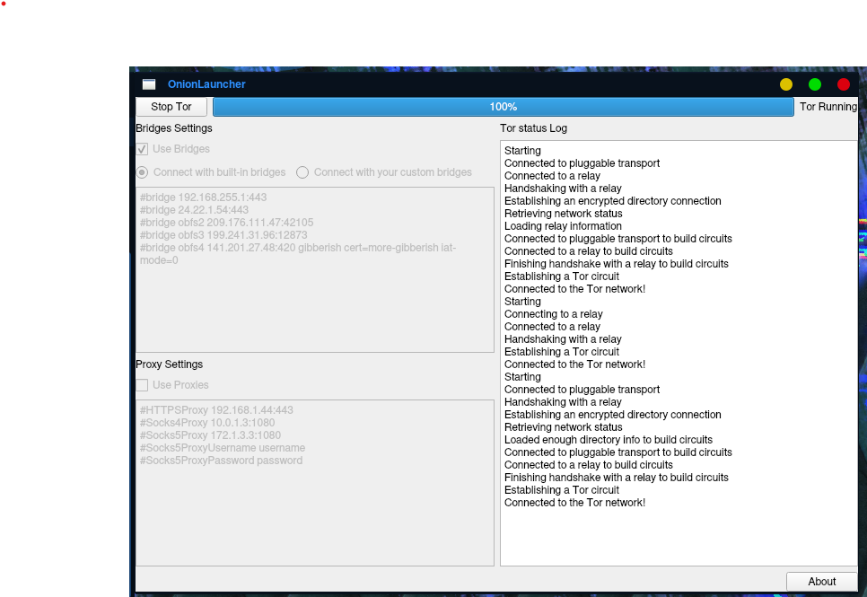

    

<h1 align="center">OnionLauncher-Uhuru</h1>

  <a> A launcher for Tor written in Python and PyQt5  </a>
   
  
  
  
  
  

This version is modified by @infoengine1337.
Uhuru OS Loid Edition contains this launcher by default.

## Dependencies

 * Python
 * [Stem](https://stem.torproject.org/)
 * [PyQt5](https://www.riverbankcomputing.com/software/pyqt/download5)

## Getting

Provided that you have all the dependencies installed, to get and launch
OnionLauncher from a Git clone:

	$ git clone https://github.com/infoengine1337/OnionLauncher-uhuru
	$ cd OnionLauncher/OnionLauncher/
	$ python main.py

